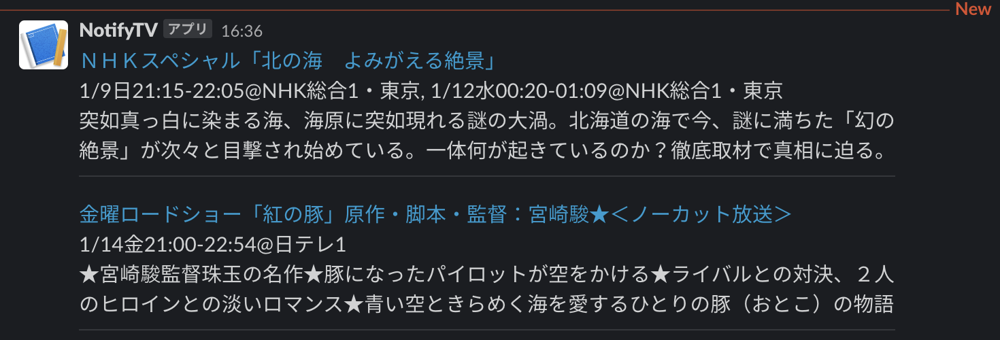

TV番組通知bot
====

TV番組表のキーワード検索をスクレイピングして、slackに通知する

## docker build
```
docker build -t puppeteer-chrome-linux .
```

参照: [Running Puppeteer in Docker](https://github.com/puppeteer/puppeteer/blob/main/docs/troubleshooting.md#running-puppeteer-in-docker)

npmパッケージで `request` を追加している


## 設定（コード冒頭に定数で定義）
- webhook_url
    + slackのIncoming Webhook URL
- keywords
    + TV番組表を検索するキーワード
    + 留意点： ソースコード中で、対象を地上波に絞っている（query string）
- exclude_keywords
    + 検索後に当該キーワードをタイトルに含むものは除外する

## run
```
docker run -i --init --rm --cap-add=SYS_ADMIN --name puppeteer-chrome puppeteer-chrome-linux node -e "`cat notify_tv_program_to_slack.js`"
```


